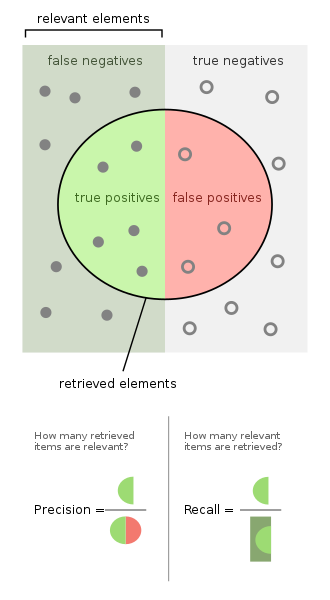

# AMMD - Notas de aula

O gráfico neste [link](https://cdn.analyticsvidhya.com/wp-content/uploads/2020/02/Screenshot-2020-02-06-at-11.09.13.png) foi trabalhado na sala de aula.

Dilema viés variância. O objetivo é encontrar o ponto ótimo. 

Obs.: ver referência do livro que o professor falou na sala de aula. Léo pegou o livro

# Métricas

A "bolinha" deveria cobrir todo o retângulo!

Em problemas de saúde, o falso negativo é pior que o falso positivo. Lembrar do cancer de mama. Se estiver analisando saúde, o **recall** é melhor porque ele é bom para detectar os falsos negativos.

No caso de acusação de um crime (reconhecimento facial) o falso positivo é pior que o falso negativo. Neste caso o **precision** é mais indicado.

Pode-se usar as duas, ou mais. Mas é importante olhar o contexto das métricas.

**Média harmônica**. É uma média que só é boa quando os testes em ambos, recall e precision, estão bem. É uma média "pessimista".

Na base de dados, é preciso ver com cuidado o que é "0" e "1". Há padrão de treinamento. No dataset do cancer, há um problema desses. O precision e o recall o alvo é o número 1. E no banco de dados, o maligno é "0". No exercicio da colega, a árvore ficou muito grande. Arvores grandes podem indicar overfitting. Então ela podou (prunne). 

Obs.: a incerteza nos dados, é objetida pela comparação em várias medidas. Ver a posição em que os números ficam "constantes" ou "estáveis". 

Vamos usar o **Geopandas**. 